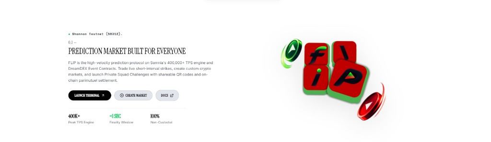

<div align="center">

  

  # FLIP — High-Velocity Consumer Prediction Protocol

  **Somnia Shannon Testnet (Chain ID 50312) • DreamDEX Event Contracts Engine • 400,000+ Peak TPS**

  <br />

  

  <br />
  <br />

  **Consumer-Grade Binary Trading Interface • Sealed-Odds Squad PvP Showdowns • Sub-150ms Exchange Feeds**

  [Launch Terminal](https://github.com/OpeyemiMoses/Flip) • [Contract Directory](#somnia-shannon-testnet-verified-contracts) • [Documentation](#system-architecture) • [On-Chain Tests](#on-chain-test-suites)

</div>

---

## Table of Contents
1. [Overview & Product Vision](#overview--product-vision)
2. [Key Innovations & Features](#key-innovations--features)
3. [Mathematical Model & Parimutuel Settlement](#mathematical-model--parimutuel-settlement)
4. [System Architecture](#system-architecture)
5. [Somnia Shannon Testnet Verified Contracts](#somnia-shannon-testnet-verified-contracts)
6. [Real-Time Zero-Latency Multi-Exchange Oracle](#real-time-zero-latency-multi-exchange-oracle)
7. [Quickstart & Local Setup](#quickstart--local-setup)
8. [On-Chain Test Suites](#on-chain-test-suites)
9. [Community & Repository Standards](#community--repository-standards)

---

## Overview & Product Vision

FLIP is a next-generation consumer prediction protocol built natively on the **Somnia Shannon Testnet** (Chain ID `50312`) and powered by **DreamDEX Event Contracts**. 

Traditional decentralized prediction markets suffer from slow block finality, high gas friction, illiquid orderbooks, and complex interfaces. FLIP solves this by pairing Somnia's **400,000+ TPS engine** and sub-second finality with a **2-tap binary trading interface**, frictionless **Privy embedded TSS wallets**, and **private sealed-odds squad showdowns** backed by deterministic on-chain parimutuel escrow.

---

## Key Innovations & Features

### 1. 2-Tap Binary Trading Interface
- **Complete Set Minting**: Deposits convert \$1.00 tUSDC collateral into `1 UP + 1 DOWN` ERC-6909 outcome tokens through DreamDEX Event Contracts.
- **Dynamic Implied Odds**: Odds are priced in $10^6$ fixed-point precision units ($900,000 = 90\% = \$0.90$).
- **Deterministic Settlement**: Winning contracts redeem $1:1$ for tUSDC collateral directly upon epoch expiry.

### 2. Private Squad PvP Challenges (Sealed Odds Mechanism)
- **Anti-Bias Game Theory**: Users create private peer-to-peer prediction battles and invite friends via instant share links or mobile QR codes.
- **Sealed Odds**: Player picks and pool distributions remain **completely concealed** until expiry to prevent herd behavior and social bias.
- **Parimutuel Escrow**: Winners claim the opposing side's deposits on-chain net of the standard **2% protocol & ecosystem fee**.

### 3. Dynamic Clean-Integer Rollover Engine
- **Decimals Removed**: Prediction questions and strike targets are strictly denominated in clean integer prices (e.g., `$79,483`, `$79,521`, `$2,492`, `$106`).
- **Achievable Expected Moves**: Subsequent rounds calculate realistic resistance, momentum, or support targets tailored to 15-minute / 1-hour volatility bands.

### 4. Frictionless Web2/Web3 Onboarding
- **Privy Email OTP**: Instant non-custodial wallet provisioning with zero seed phrase friction.
- **Web3 Connector**: Native support for MetaMask, Coinbase Wallet, Rabby, and Rainbow with automated network switching to Somnia Shannon (`50312`).

---

## Mathematical Model & Parimutuel Settlement

### 1. Parimutuel Pool Equilibrium ($1.00 USDso Parity)
Every binary market guarantees mathematical conservation of collateral:
$$\text{Pool Collateral} = \sum \text{Invested}_{\text{UP}} + \sum \text{Invested}_{\text{DOWN}}$$
$$\text{Winning Share Payout} = \frac{\text{Total Distributable Pot}}{\text{Total Winning Shares}} = \$1.00 \text{ tUSDC per winning contract}$$

### 2. Squad Parimutuel Distribution Logic
- **Unanimous Win Scenario** ($\text{Winners} = \text{Total Squad}$):
  $$\text{Payout}_i = \text{Deposit}_i \times (1 - 0.02)$$
  *All participants receive their stake back net of the 2% protocol & ecosystem fee.*
- **Unanimous Loss Scenario** ($\text{Losers} = \text{Total Squad}$):
  $$\text{Protocol Fee} = \text{Total Pot} \times 0.02, \quad \text{Ecosystem Pot} = \text{Total Pot} \times 0.98$$
- **Mixed Win / Loss Scenario**:
  $$\text{Distributable Pot} = \text{Losers Pot} \times (1 - 0.02)$$
  $$\text{Payout}_w = \text{Deposit}_w + \left( \text{Distributable Pot} \times \frac{\text{Deposit}_w}{\sum \text{Deposit}_{\text{Winners}}} \right)$$

---

## System Architecture

```
┌────────────────────────────────────────────────────────────────────────────────────────┐
│                                   FLIP CLIENT LAYER                                   │
│    Next-Gen Binary Trading UI  •  Private Squad PvP Rooms  •  Community Market Mint    │
└──────────────────┬─────────────────────────────────┬───────────────────────────────────┘
                   │                                 │
                   ▼                                 ▼
┌─────────────────────────────────────┐   ┌──────────────────────────────────────────────┐
│       PRIVY & WEB3 WALLET LAYER     │   │      ZERO-LATENCY EXCHANGE ORACLE ENGINE     │
│ • Email OTP & Embedded TSS Wallet   │   │ • Gate.io Global Spot Ticker (Primary)       │
│ • Web3 Connect (MetaMask, Rabby)    │   │ • Huobi/HTX Multi-Ticker Fallback (Priority2)│
│ • Somnia Shannon Auto-Switch (50312)│   │ • Sub-150ms Spot Prices (BTC, ETH, SOL, etc.)│
└──────────────────┬──────────────────┘   └──────────────────────┬───────────────────────┘
                   │                                             │
                   ▼                                             ▼
┌────────────────────────────────────────────────────────────────────────────────────────┐
│                      DREAMDEX EVENT CONTRACTS & SOMNIA SHANNON L1                      │
│                                                                                        │
│  • Binary Markets Module:   0x3ecC694Cef705358864a646142ac17A90E29e388                │
│  • Markets Core & CLOB:     0x2802504314685D89bF6C992CA5a8e7cC78bc0294                │
│  • Binary Settlement:       0xbF4a49e0Dfd092e5FBE8E5761064C49533e6Ed23                │
│  • ERC-6909 Outcome Tokens: 0xB52c5934113Af5c0Bb20eb3C72290C8215f755b9                │
│  • Collateral Router:       0xbC0C9834B15ACE38bB50dDaa7d7f7C7CC4DC183C                │
│  • tUSDC Collateral Token:  0x70a86D8842FB63C4Ad2b7cdddF530eBf1BB25d8E                │
└────────────────────────────────────────────────────────────────────────────────────────┘
```

---

## Somnia Shannon Testnet Verified Contracts

| Contract Name | Contract Address | Explorer Link |
| :--- | :--- | :--- |
| **Binary Markets Module** | `0x3ecC694Cef705358864a646142ac17A90E29e388` | [Shannon Explorer](https://shannon-explorer.somnia.network/address/0x3ecC694Cef705358864a646142ac17A90E29e388) |
| **Markets Core & Orderbook** | `0x2802504314685D89bF6C992CA5a8e7cC78bc0294` | [Shannon Explorer](https://shannon-explorer.somnia.network/address/0x2802504314685D89bF6C992CA5a8e7cC78bc0294) |
| **Binary Settlement Engine** | `0xbF4a49e0Dfd092e5FBE8E5761064C49533e6Ed23` | [Shannon Explorer](https://shannon-explorer.somnia.network/address/0xbF4a49e0Dfd092e5FBE8E5761064C49533e6Ed23) |
| **ERC-6909 Outcome Tokens** | `0xB52c5934113Af5c0Bb20eb3C72290C8215f755b9` | [Shannon Explorer](https://shannon-explorer.somnia.network/address/0xB52c5934113Af5c0Bb20eb3C72290C8215f755b9) |
| **Collateral Router** | `0xbC0C9834B15ACE38bB50dDaa7d7f7C7CC4DC183C` | [Shannon Explorer](https://shannon-explorer.somnia.network/address/0xbC0C9834B15ACE38bB50dDaa7d7f7C7CC4DC183C) |
| **tUSDC Collateral Token** | `0x70a86D8842FB63C4Ad2b7cdddF530eBf1BB25d8E` | [Shannon Explorer](https://shannon-explorer.somnia.network/address/0x70a86D8842FB63C4Ad2b7cdddF530eBf1BB25d8E) |

---

## Real-Time Zero-Latency Multi-Exchange Oracle

FLIP implements a resilient multi-exchange price pipeline:
1. **Primary Feed (Gate.io Spot API)**: Fetches all supported pairs (`BTC_USDT`, `ETH_USDT`, `SOL_USDT`, `SUI_USDT`, `DOGE_USDT`, `PEPE_USDT`) in a single payload (<150ms latency, 0 rate limits).
2. **Secondary Feed (Huobi/HTX Global Tickers)**: Instant fallback ensuring uninterrupted streaming worldwide.
3. **Settlement Precision**: Direct oracle query executed at the exact second of epoch expiration.

---

## Quickstart & Local Setup

### 1. Clone Repository
```bash
git clone https://github.com/OpeyemiMoses/Flip.git
cd Flip
```

### 2. Install Dependencies
```bash
npm install
```

### 3. Configure Environment
Copy `.env.example` to `.env`:
```bash
cp .env.example .env
```
Ensure your configuration matches Somnia Shannon:
```ini
VITE_SOMNIA_RPC_URL=https://dream-rpc.somnia.network
VITE_PRIVY_APP_ID=cm66w9hha01x2k4a827v3r68h
VITE_APP_ENV=testnet
```

### 4. Launch Development Server
```bash
npm run dev
```
Open [http://localhost:3000](http://localhost:3000) in your browser.

---

## On-Chain Test Suites

Execute verification scripts against Somnia Shannon testnet:

```bash
# 1. Query live DreamDEX binary pools and check network block height
npm run test:discover

# 2. Test full event contracts lifecycle (mintSet -> maker -> taker -> cancel)
npm run test:lifecycle

# 3. Test epoch resolution and winning collateral redemption
npm run test:redeem

# 4. Production build and TypeScript validation
npm run build
```

---

## Community & Repository Standards

- **[Code of Conduct](./CODE_OF_CONDUCT.md)**: Community standards and harassment-free pledge.
- **[Contributing Guidelines](./CONTRIBUTING.md)**: Development workflow, design constraints, and PR submission process.
- **[Security Policy](./SECURITY.md)**: Responsible vulnerability disclosure and bug bounty guidelines.
- **[License](./LICENSE)**: Open-source licensed under the MIT License.
